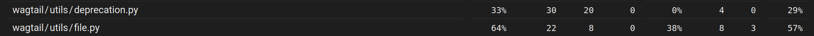
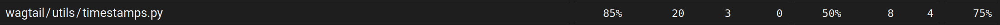
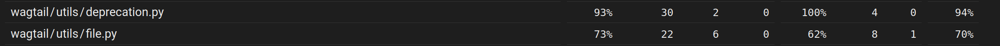
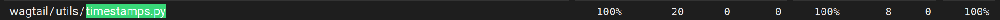

# Testes e Cobertura - Etapas H e L - Grupo 03

## Estado original

Antes das alterações, a suíte de testes do Wagtail apresentava os seguintes números:

| Métrica | Valor |
|---------|-------|
| Total de testes | 6.770 |
| Testes OK | 6.723 |
| Skipped | 38 |
| Expected failures | 9 |
| Cobertura total (statements) | 95% |
| Cobertura total (branches) | 86% |
| **Cobertura combinada** | **94%** |

## Arquivos selecionados para melhoria

Foram escolhidos 3 arquivos do módulo `wagtail/utils/` com baixa cobertura, fáceis de testar e sem dependências de banco de dados ou HTTP:




| Arquivo | Cobertura | Razão |
|---------|----------------|-------|
| `wagtail/utils/deprecation.py` | 29% | `MovedDefinitionHandler` sem testes unitários |
| `wagtail/utils/timestamps.py` | 75% | Funções puras sem testes dedicados |
| `wagtail/utils/file.py` | 57% | Caminhos de erro e `file_digest` não cobertos |

## Testes adicionados

Todos os testes foram adicionados em `wagtail/tests/test_utils.py`, seguindo o padrão existente do projeto (classes `SimpleTestCase`, nomes `Test<NomeDaFuncao>`).

### 1. `wagtail/utils/deprecation.py` — 5 testes

Classe `TestMovedDefinitionHandler`:

| Teste | O que verifica |
|-------|---------------|
| `test_moved_definition_resolves` | Definição movida é carregada do novo módulo |
| `test_moved_definition_emits_warning` | `RemovedInWagtail90Warning` é emitido no primeiro acesso |
| `test_moved_definition_cached` | Segundo acesso não emite warning (cache) |
| `test_original_attribute_passthrough` | Atributos não movidos delegam ao módulo original |
| `test_moved_definition_renamed` | Suporte a renomeação via tuple `(módulo, novo_nome)` |

**Decisão:** O `MovedDefinitionHandler` substitui `sys.modules[__name__]` por um wrapper que intercepta `__getattr__`. Os testes usam `types.ModuleType` para simular módulos fonte e destino, registrando-os em `sys.modules` durante `setUp` e limpando em `tearDown`.

### 2. `wagtail/utils/timestamps.py` — 6 testes

Classes `TestEnsureUtc`, `TestParseDatetimeLocalized` e `TestRenderTimestamp`:

| Teste | O que verifica |
|-------|---------------|
| `test_naive_becomes_utc` | Datetime naive vira UTC-aware com `USE_TZ=True` |
| `test_aware_converts_to_utc` | Timezone diferente (GMT-5) é convertido para UTC |
| `test_no_tz_returns_unchanged` | `USE_TZ=False` retorna datetime sem alteração |
| `test_already_utc_stays_utc` | Datetime já UTC permanece inalterado |
| `test_naive_string_becomes_aware` | String sem timezone vira aware com `USE_TZ=True` |
| `test_aware_renders_localtime` | `render_timestamp` converte para hora local |

**Decisão:** As funções dependem de `django.utils.timezone` e `settings.USE_TZ`. Os testes usam `@override_settings(USE_TZ=True/False)` para alternar entre os modos. Para o teste de conversão de timezone, foi usado `timezone.get_fixed_timezone(timedelta(hours=-5))` para simular um fuso não-UTC.

### 3. `wagtail/utils/file.py` — 4 testes (adicionados à classe `HashFileLikeTestCase` existente)

| Teste | O que verifica |
|-------|---------------|
| `test_hashes_filelike_seek_raises_unsupported` | `UnsupportedOperation` no `seek(0)` é capturado |
| `test_hashes_filelike_restores_position` | Posição do arquivo é restaurada após hash |
| `test_hashes_filelike_without_seek_or_tell` | Objeto apenas com `read()`/`readinto()` funciona |
| `test_hashes_filelike_has_tell_but_no_seek` | Objeto com `tell()` mas sem `seek()` funciona |

**Decisão:** Python 3.13 usa `hashlib.file_digest()` que exige as interfaces `readable()` e `readinto()`. Os objetos customizados implementam ambas. O `test_hashes_large_file` existente (que testa o caminho manual de chunking) é ignorado em Python ≥ 3.11 por usar `@unittest.skipIf(hasattr(hashlib, "file_digest"), ...)`.

## Resultado

Novamente, rodamos `make coverage` para ver os resultados.
```
Ran 6787 tests in 342.885s

OK (skipped=38, expected failures=9)
```
Os novos testes funcionaram, agora para o relatório de cobertura:




Perfeito, a cobertura aumentou como esperado! `timestamps.py` agora chega a ter 100% de cobertura, e `deprecation.py` e `file.py` tem uma cobertura significativamente mais alta.
